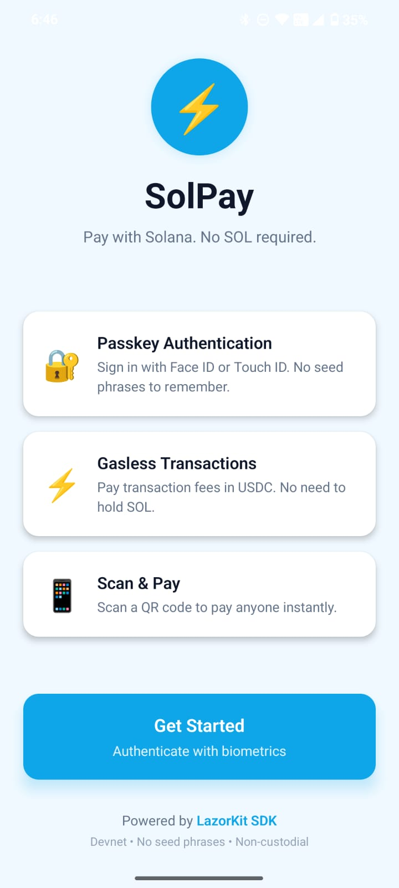
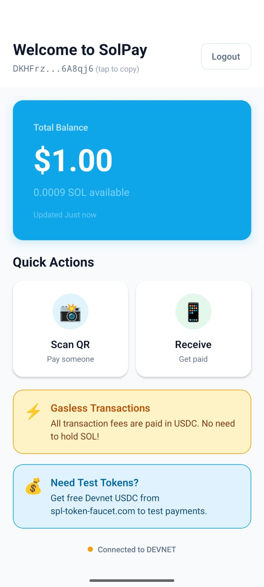
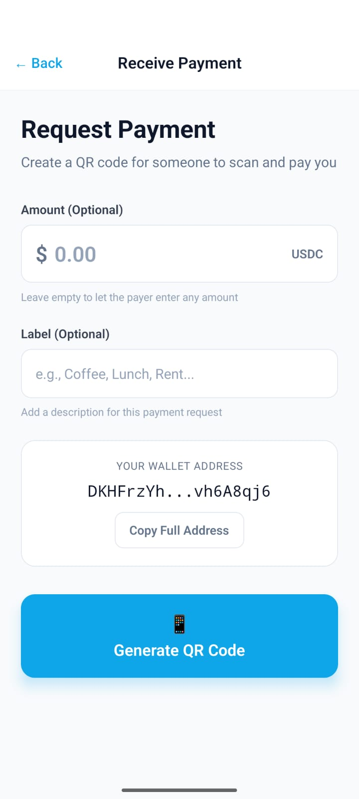
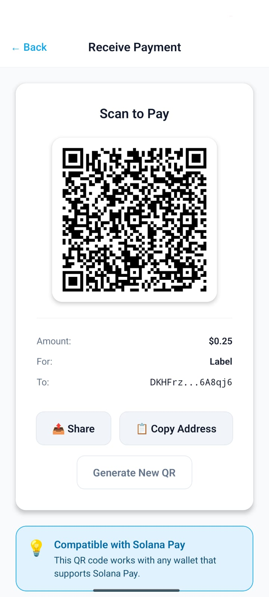
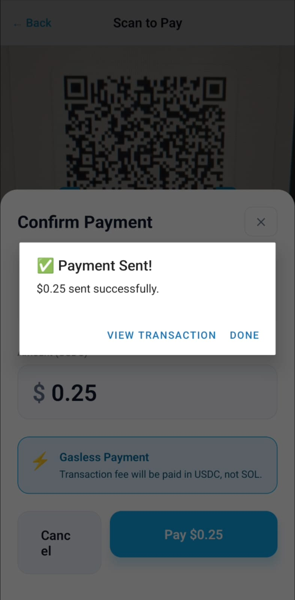

# ⚡ SolPay - LazorKit React Native Template

> **The definitive React Native starter template for building mobile Solana payment apps with passkey authentication and gasless transactions.**

**Clone → Install → Run → Pay in under 5 minutes.** No seed phrases. No SOL required.

[](https://reactnative.dev/)
[](https://expo.dev/)
[](https://lazorkit.com/)
[](https://www.typescriptlang.org/)

---

## � App Preview

<div align="center">
  
  
  
</div>

<div align="center">
  
  
</div>

### 🎥 Video Demo

<div align="center">
  <a href="./assets/full-demo.mp4">
    
  </a>
</div>

<p align="center">
  <a href="./assets/full-demo.mp4">Open the GitHub-friendly MP4 demo</a>
</p>

> **See the full payment flow in action** - from authentication to gasless transaction confirmation.

---

## �📖 Table of Contents

1. [What Is This?](#-what-is-this)
2. [Why LazorKit & Passkeys?](#-why-lazorkit--passkeys)
3. [What Are Gasless Transactions?](#-what-are-gasless-transactions)
4. [Quick Start (5 Minutes)](#-quick-start-5-minutes)
5. [Project Structure](#-project-structure)
6. [Architecture Deep Dive](#-architecture-deep-dive)
7. [Code Walkthrough](#-code-walkthrough)
8. [Step-by-Step Tutorials](#-step-by-step-tutorials)
9. [Troubleshooting](#-troubleshooting)
10. [Security Notes](#-security-notes)
11. [Extending This Template](#-extending-this-template)
12. [Production Checklist](#-production-checklist)
13. [Resources](#-resources)

---

## 🎯 What Is This?

This is a **production-ready starter template** that demonstrates how to build a mobile payment app on Solana using LazorKit SDK. It showcases:

| Feature | What It Does | Why It Matters |
|---------|--------------|----------------|
| **Passkey Authentication** | Users sign in with Face ID/Touch ID | No seed phrases to lose or steal |
| **Gasless Transactions** | Pay fees in USDC, not SOL | Users never need to buy SOL |
| **QR Code Payments** | Scan to pay, like UPI | Familiar mobile payment UX |
| **Smart Wallets** | Non-custodial, secure wallets | Users own their funds, you don't hold keys |

### Who Is This For?

- **Developers new to Solana** who want to build mobile apps
- **Web2 developers** transitioning to Web3
- **Hackathon participants** needing a solid starting point
- **Product teams** evaluating mobile payment solutions

### What You'll Build

A fully functional payment app that lets users:
1. Create a wallet with Face ID (no seed phrases)
2. View their USDC and SOL balances
3. Scan QR codes to pay
4. Generate QR codes to receive payments
5. All with gasless transactions (fees paid in USDC)

---

## 🔐 Why LazorKit & Passkeys?

### The Problem with Traditional Crypto Wallets

Traditional wallets require users to:
- Write down 12-24 word seed phrases
- Store them securely forever
- Never lose them (or lose all funds)
- Understand complex crypto concepts

**Result**: 90%+ of mainstream users abandon the onboarding flow.

### The LazorKit Solution

LazorKit uses **passkeys** (WebAuthn standard) for authentication:

```
┌─────────────────────────────────────────────────────────────┐
│  Traditional Wallet          │  LazorKit Passkey Wallet     │
├─────────────────────────────────────────────────────────────┤
│  "Write down these 24 words" │  "Tap Face ID to continue"   │
│  "Store them securely"       │  "That's it, you're done"    │
│  "Never share or lose them"  │  "Synced across devices"     │
└─────────────────────────────────────────────────────────────┘
```

### How Passkeys Work

1. **Creation**: Device generates a cryptographic key pair
2. **Storage**: Private key stored in device's secure enclave
3. **Authentication**: Biometric unlocks the key for signing
4. **Sync**: Keys can sync across devices via iCloud/Google

**Security**: Same technology that protects your banking apps.

---

## ⚡ What Are Gasless Transactions?

### The Problem with Gas Fees

On Solana, every transaction requires SOL for fees:
- Users must buy SOL somewhere
- They need SOL in their wallet before doing anything
- New users get stuck at "insufficient SOL" errors

### The Gasless Solution

LazorKit's **paymaster** infrastructure covers SOL fees:

```
┌─────────────────────────────────────────────────────────────┐
│  Traditional Transaction     │  Gasless Transaction         │
├─────────────────────────────────────────────────────────────┤
│  1. User has USDC            │  1. User has USDC             │
│  2. User needs SOL for fees  │  2. User signs transaction    │
│  3. User buys SOL            │  3. Paymaster pays SOL fee    │
│  4. User pays SOL fee        │  4. User pays fee in USDC     │
│  5. Transaction executes     │  5. Transaction executes      │
└─────────────────────────────────────────────────────────────┘
```

### How It Works Under the Hood

1. Your app creates a transaction (e.g., send 10 USDC)
2. LazorKit's paymaster calculates the SOL fee (~0.000005 SOL)
3. Paymaster converts that to USDC equivalent (~$0.001)
4. User's transaction includes a tiny USDC payment to paymaster
5. Paymaster pays the SOL fee on behalf of the user
6. Transaction executes successfully

**Result**: Users only need USDC. Zero SOL required.

---

## 🚀 Quick Start (5 Minutes)

### Prerequisites

Before you begin, ensure you have:

- **Node.js 18+**: [Download here](https://nodejs.org/)
- **pnpm**: Install with `npm install -g pnpm`
- **Expo CLI**: Install with `npm install -g expo-cli`
- **Expo Go app**: Download on your [iOS](https://apps.apple.com/app/apple-store/id982107779) or [Android](https://play.google.com/store/apps/details?id=host.exp.exponent) device
- **Simulator/Emulator** (optional): Xcode for iOS, Android Studio for Android

### Step 1: Clone and Install

```bash
# Clone the repository
git clone https://github.com/your-username/lazorkit-react-native-pay-with-solana-starter.git
cd lazorkit-react-native-pay-with-solana-starter

# Install dependencies
pnpm install
```

### Step 2: Start the Development Server

```bash
pnpm start
```

You'll see a QR code in your terminal.

### Step 3: Run on Your Device

**Option A: Physical Device (Recommended)**
1. Open Expo Go app on your phone
2. Scan the QR code from the terminal
3. App loads on your device

**Option B: Simulator**
```bash
# iOS (macOS only)
pnpm ios

# Android
pnpm android
```

### Step 4: Create Your Wallet

1. Tap **"Get Started"**
2. Authenticate with Face ID / Touch ID
3. LazorKit portal opens → Creates your passkey
4. Portal redirects back → You're authenticated!

### Step 5: Get Test Tokens

Your wallet needs Devnet USDC to test payments:

1. Copy your wallet address from the home screen
2. Go to [spl-token-faucet.com](https://spl-token-faucet.com)
3. Paste your address and request USDC
4. Balance updates automatically (or pull to refresh)

### Step 6: Make a Payment

1. Tap **"Receive"** → Generate a QR code
2. Take a screenshot or use another device
3. Tap **"Scan QR"** → Scan your QR code
4. Enter amount → Confirm payment
5. 🎉 Gasless transaction complete!

---

## 📁 Project Structure

```
lazorkit-react-native-pay-with-solana-starter/
│
├── app/                          # Expo Router entry points
│   ├── _layout.tsx               # Root layout with polyfills
│   └── index.tsx                 # Main app with LazorKitProvider
│
├── src/                          # Source code (main codebase)
│   │
│   ├── components/               # Reusable UI components
│   │   ├── Button.tsx            # Primary action button
│   │   ├── Card.tsx              # Container component
│   │   ├── BalanceCard.tsx       # Balance display
│   │   ├── ActionButton.tsx      # Grid action button
│   │   ├── Header.tsx            # Screen header
│   │   ├── InfoBanner.tsx        # Information displays
│   │   ├── NetworkBadge.tsx      # Network indicator
│   │   ├── StateMessage.tsx      # Loading/error/success states
│   │   └── index.ts              # Barrel export
│   │
│   ├── hooks/                    # Custom React hooks
│   │   ├── useWalletSession.ts   # Wallet connection & auth
│   │   ├── useBalance.ts         # Balance fetching
│   │   ├── useTransaction.ts     # Transaction execution
│   │   └── index.ts              # Barrel export
│   │
│   ├── lib/                      # Utilities & configuration
│   │   ├── constants.ts          # App configuration
│   │   ├── errors.ts             # Error handling & logging
│   │   ├── formatters.ts         # Display formatting
│   │   ├── validators.ts         # Input validation & QR parsing
│   │   ├── device.ts             # Clipboard & haptics
│   │   └── index.ts              # Barrel export
│   │
│   ├── screens/                  # App screens
│   │   ├── AuthScreen.tsx        # Passkey authentication
│   │   ├── HomeScreen.tsx        # Dashboard with balance
│   │   ├── ScanScreen.tsx        # QR scanner for payments
│   │   ├── ReceiveScreen.tsx     # QR generator for receiving
│   │   └── index.ts              # Barrel export
│   │
│   ├── types/                    # TypeScript definitions
│   │   └── index.ts              # All type definitions
│   │
│   └── index.ts                  # Main barrel export
│
├── docs/                         # Documentation
│   ├── TUTORIAL_1_PASSKEY_WALLET.md
│   └── TUTORIAL_2_GASLESS_TRANSACTIONS.md
│
├── app.json                      # Expo configuration
├── package.json                  # Dependencies
├── tsconfig.json                 # TypeScript config
└── README.md                     # This file
```

### Why This Structure?

| Folder | Purpose | When to Modify |
|--------|---------|----------------|
| `app/` | Expo Router entry | Rarely (only for navigation changes) |
| `src/components/` | UI building blocks | Adding new UI elements |
| `src/hooks/` | Business logic | Adding new features |
| `src/lib/` | Utilities | Changing config or helpers |
| `src/screens/` | Full page views | Adding new screens |
| `src/types/` | TypeScript types | When data shapes change |

---

## 🏗 Architecture Deep Dive

### Data Flow Diagram

```
┌──────────────────────────────────────────────────────────────────────┐
│                            USER INTERACTION                          │
└───────────────────────────────────┬──────────────────────────────────┘
                                    │
                                    ▼
┌──────────────────────────────────────────────────────────────────────┐
│                           SCREEN COMPONENTS                          │
│   AuthScreen  │  HomeScreen  │  ScanScreen  │  ReceiveScreen         │
└───────────────────────────────────┬──────────────────────────────────┘
                                    │
                                    ▼
┌──────────────────────────────────────────────────────────────────────┐
│                           CUSTOM HOOKS                               │
│   useWalletSession   │   useBalance   │   useTransaction             │
└───────────────────────────────────┬──────────────────────────────────┘
                                    │
                                    ▼
┌──────────────────────────────────────────────────────────────────────┐
│                         LAZORKIT SDK                                 │
│   LazorKitProvider   │   useWallet   │   signAndSendTransaction      │
└───────────────────────────────────┬──────────────────────────────────┘
                                    │
                                    ▼
┌──────────────────────────────────────────────────────────────────────┐
│                     SOLANA NETWORK (DEVNET)                          │
└──────────────────────────────────────────────────────────────────────┘
```

### State Machine: Wallet Connection

```
                    ┌─────────────┐
                    │ NOT_CREATED │ ◄─── Initial state
                    └──────┬──────┘
                           │ authenticate()
                           ▼
                    ┌─────────────┐
                    │  CREATING   │ ◄─── Checking biometrics
                    └──────┬──────┘
                           │ biometric success
                           ▼
                    ┌─────────────┐
                    │ CONNECTING  │ ◄─── LazorKit portal open
                    └──────┬──────┘
                           │ portal callback
                           ▼
                    ┌─────────────┐
                    │  CONNECTED  │ ◄─── Ready to use
                    └─────────────┘
                           │
           ┌───────────────┴───────────────┐
           ▼                               ▼
    ┌─────────────┐                 ┌─────────────┐
    │   ERROR     │                 │   LOGOUT    │
    └─────────────┘                 └─────────────┘
```

### State Machine: Transaction

```
    ┌──────────────┐
    │   UNSIGNED   │ ◄─── Transaction created
    └──────┬───────┘
           │ sendPayment()
           ▼
    ┌──────────────┐
    │   SIGNING    │ ◄─── User authenticating with passkey
    └──────┬───────┘
           │ signature obtained
           ▼
    ┌──────────────┐
    │  SUBMITTING  │ ◄─── Sending to paymaster
    └──────┬───────┘
           │ submitted to network
           ▼
    ┌──────────────┐
    │  CONFIRMING  │ ◄─── Waiting for confirmation
    └──────┬───────┘
           │ confirmed on-chain
           ▼
    ┌──────────────┐
    │  CONFIRMED   │ ◄─── Success!
    └──────────────┘

         (Any step can fail)
                │
                ▼
    ┌──────────────┐
    │    FAILED    │ ◄─── Show error, allow retry
    └──────────────┘
```

---

## 💻 Code Walkthrough

### 1. Polyfills Setup (app/_layout.tsx)

```typescript
// ⚠️ MUST be first - before any other imports
import 'react-native-get-random-values';  // Crypto random
import 'react-native-url-polyfill/auto';  // URL parsing
import { Buffer } from 'buffer';
global.Buffer = global.Buffer || Buffer;  // Buffer for web3.js
```

**Why**: Solana's web3.js library uses Node.js APIs not available in React Native. These polyfills provide compatibility.

### 2. LazorKit Provider (app/index.tsx)

```typescript
<LazorKitProvider
  rpcUrl={RPC_URL}                    // Solana RPC endpoint
  portalUrl={PORTAL_URL}              // LazorKit auth portal
  configPaymaster={PAYMASTER_CONFIG}  // Gasless config
>
  {/* Your app here */}
</LazorKitProvider>
```

**Why**: Provider gives all child components access to wallet functionality via hooks.

### 3. Authentication (src/hooks/useWalletSession.ts)

```typescript
const authenticate = async () => {
  // Step 1: Check biometric availability
  await checkBiometricAvailability();
  
  // Step 2: Prompt for biometric auth
  await promptBiometric();
  
  // Step 3: Connect via LazorKit
  await wallet.connect({
    redirectUrl: APP_SCHEME,  // Deep link back to app
  });
};
```

**Why**: Two-layer security - device biometric + LazorKit passkey.

### 4. Gasless Transaction (src/hooks/useTransaction.ts)

```typescript
const signature = await signAndSendTransaction(
  {
    instructions: [transferInstruction],
    transactionOptions: {
      feeToken: 'USDC',  // 🚀 THIS MAKES IT GASLESS!
      clusterSimulation: 'devnet',
    },
  },
  {
    redirectUrl: APP_SCHEME,
  }
);
```

**Why**: Setting `feeToken: 'USDC'` tells the paymaster to accept USDC for fees instead of requiring SOL.

### 5. QR Code Format (src/lib/validators.ts)

```typescript
// Solana Pay format: solana:<address>?amount=<amount>&spl-token=<mint>
const qrData = `solana:${walletAddress}?amount=10&spl-token=${USDC_MINT}`;
```

**Why**: Using Solana Pay standard ensures compatibility with other wallets.

---

## 📚 Step-by-Step Tutorials

### Tutorial 1: Creating a Passkey Wallet
**📖 [Read Full Tutorial](./docs/TUTORIAL_1_PASSKEY_WALLET.md)**

Learn step-by-step how to:
- Configure polyfills correctly
- Set up LazorKitProvider
- Implement biometric authentication
- Handle deep linking
- Manage wallet sessions

**Time**: 15-20 minutes | **Difficulty**: Beginner

### Tutorial 2: Sending Gasless Transactions
**📖 [Read Full Tutorial](./docs/TUTORIAL_2_GASLESS_TRANSACTIONS.md)**

Learn step-by-step how to:
- Understand gasless transaction flow
- Create SPL token transfers
- Sign and send via LazorKit
- Handle transaction states
- Verify on-chain

**Time**: 20-25 minutes | **Difficulty**: Intermediate

---

## 🔧 Troubleshooting

### Common Issues

#### ❌ "Biometric authentication not available"

**Cause**: Device doesn't have Face ID/Touch ID set up.

**Fix**:
1. Go to device Settings
2. Enable Face ID/Touch ID
3. Add at least one biometric credential
4. Restart the app

#### ❌ "Deep link not working" / App doesn't return after portal

**Cause**: Deep link scheme mismatch.

**Fix**:
1. Check `app.json` has `"scheme": "lazorkitapp"`
2. Check `src/lib/constants.ts` has `APP_SCHEME = 'lazorkitapp://home'`
3. Rebuild the app: `npx expo prebuild --clean`

**Test deep link manually**:
```bash
# iOS Simulator
xcrun simctl openurl booted lazorkitapp://home

# Android
adb shell am start -W -a android.intent.action.VIEW -d "lazorkitapp://home"
```

#### ❌ "Insufficient balance"

**Cause**: Wallet doesn't have enough USDC.

**Fix**:
1. Copy your wallet address from home screen
2. Go to [spl-token-faucet.com](https://spl-token-faucet.com)
3. Request Devnet USDC
4. Wait ~30 seconds and refresh

#### ❌ "Transaction failed" with no details

**Cause**: Usually network or RPC issues.

**Fix**:
1. Check internet connection
2. Try again (transient RPC issues common on devnet)
3. If persistent, try a different RPC endpoint

#### ❌ "Invalid QR code"

**Cause**: QR code not in Solana Pay format.

**Fix**:
- Use the app's Receive screen to generate valid QR codes
- Ensure QR starts with `solana:` followed by a valid address

#### ❌ Camera permission denied

**Cause**: User denied camera access.

**Fix**:
1. Go to device Settings > App name
2. Enable Camera permission
3. Return to app

### Debug Logging

The app includes structured logging. View logs in your terminal:

```bash
# All logs visible when running with Expo
pnpm start

# In the terminal, you'll see:
# [2026-01-01T12:00:00.000Z] [INFO] [WalletSession] User authenticated
# [2026-01-01T12:00:01.000Z] [DEBUG] [Balance] Fetching balances
```

---

## 🔒 Security Notes

### What LazorKit Handles

| Security Feature | Implementation |
|-----------------|----------------|
| Key Storage | Device secure enclave (Keychain/Keystore) |
| Authentication | WebAuthn/Passkeys standard |
| Transaction Signing | Passkey-based, requires biometric |
| Key Recovery | Passkey sync via iCloud/Google |

### What You Should Consider

1. **HTTPS Only**: All network calls should use HTTPS in production
2. **Input Validation**: Always validate addresses and amounts
3. **Error Messages**: Don't expose sensitive info in errors
4. **Rate Limiting**: Implement in production to prevent abuse
5. **Audit**: Get a security audit before mainnet launch

### Non-Custodial Design

**You never hold user funds or keys:**
- Private keys exist only in user's device secure enclave
- You cannot access, recover, or steal user funds
- Users are fully in control of their assets

---

## 🚀 Extending This Template

### Adding a New Screen

1. Create the screen in `src/screens/`:

```typescript
// src/screens/SettingsScreen.tsx
export function SettingsScreen({ onBack }: { onBack: () => void }) {
  return (
    <View>
      <Header title="Settings" onBack={onBack} />
      {/* Your content */}
    </View>
  );
}
```

2. Export from barrel file:
```typescript
// src/screens/index.ts
export { SettingsScreen } from './SettingsScreen';
```

3. Add to navigation in `app/index.tsx`:
```typescript
case 'settings':
  return <SettingsScreen onBack={handleBack} />;
```

### Adding Transaction History

1. Create a hook to fetch transactions:
```typescript
// src/hooks/useTransactionHistory.ts
export function useTransactionHistory() {
  // Fetch from Solana RPC or indexer
}
```

2. Create a screen to display them
3. Add navigation from HomeScreen

### Switching to Mainnet

1. Update `src/lib/constants.ts`:
```typescript
export const RPC_URL = 'https://your-mainnet-rpc.com';
export const NETWORK = 'mainnet-beta';
export const USDC_MINT = 'EPjFWdd5AufqSSqeM2qN1xzybapC8G4wEGGkZwyTDt1v'; // Mainnet USDC
export const PAYMASTER_URL = 'https://kora.mainnet.lazorkit.com';
```

2. Get a LazorKit API key for production rate limits
3. Use a dedicated RPC provider (Helius, QuickNode, etc.)

---

## ✅ Production Checklist

Before going to mainnet:

- [ ] Switch to mainnet RPC endpoint
- [ ] Update USDC mint to mainnet address
- [ ] Get LazorKit production API key
- [ ] Enable API key in paymaster config
- [ ] Use dedicated RPC provider (not public endpoint)
- [ ] Add error tracking (Sentry, etc.)
- [ ] Add analytics
- [ ] Security audit
- [ ] Test all flows on mainnet
- [ ] Set up monitoring and alerts
- [ ] Create user support documentation

---

## 📚 Resources

### LazorKit

- [LazorKit Documentation](https://docs.lazorkit.com)
- [LazorKit GitHub](https://github.com/lazor-kit)

### Solana

- [Solana Docs](https://docs.solana.com)
- [Solana Cookbook](https://solanacookbook.com)
- [Solana Pay Spec](https://docs.solanapay.com)

### React Native

- [React Native Docs](https://reactnative.dev)
- [Expo Docs](https://docs.expo.dev)
- [Expo Router Docs](https://docs.expo.dev/router/introduction/)

---

## 🙏 Acknowledgments

- **LazorKit Team** for making passkey wallets possible
- **Solana Foundation** for the ecosystem
- **Expo Team** for excellent React Native tooling

---

**Built with ❤️ for the Solana ecosystem**

*If this template helped you, give it a ⭐ on GitHub!*
